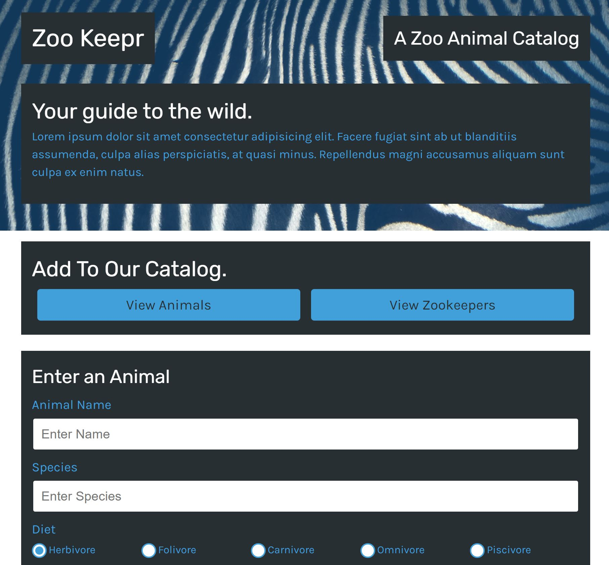

# Zookeepr-Express.js

## Description

The purpose of this project was to create a website for a zoo. The website allows users to view infomation about animals and zookeepers. Users can search for animals and zookeepers using various criteria (name, age, personality traits, etc). Users can also add animals and zookeepers to the database. The project uses express.js to access API routes for users to get and post information.

## Installation

To install this project, you can clone the repository by using the command prompt

$ git clone https://github.com/AllysonMcGrath/taskmaster-pro.git

Detailed instructions for cloning GitHub repositories can be found [here.](https://docs.github.com/en/github/creating-cloning-and-archiving-repositories/cloning-a-repository-from-github/cloning-a-repository)

## Usage

You can see the deployed site [here](https://mcgrath-zookeepr.herokuapp.com/).

When displaying correctly, the website should look like this:

Use standard git commands within this repository.

Examples:

$ git mv index.html ../
$ git add .
$ git commit -m "commit description"
$ git push origin main

## Credits

Trilogy Education Services, LLC, a 2U, Inc. brand

[Coding Boot Camp at UT](https://github.com/the-Coding-Boot-Camp-at-UT)

## License

MIT License

Copyright (c) 2021 Allyson McGrath

Permission is hereby granted, free of charge, to any person obtaining a copy
of this software and associated documentation files (the "Software"), to deal
in the Software without restriction, including without limitation the rights
to use, copy, modify, merge, publish, distribute, sublicense, and/or sell
copies of the Software, and to permit persons to whom the Software is
furnished to do so, subject to the following conditions:

The above copyright notice and this permission notice shall be included in all
copies or substantial portions of the Software.

THE SOFTWARE IS PROVIDED "AS IS", WITHOUT WARRANTY OF ANY KIND, EXPRESS OR
IMPLIED, INCLUDING BUT NOT LIMITED TO THE WARRANTIES OF MERCHANTABILITY,
FITNESS FOR A PARTICULAR PURPOSE AND NONINFRINGEMENT. IN NO EVENT SHALL THE
AUTHORS OR COPYRIGHT HOLDERS BE LIABLE FOR ANY CLAIM, DAMAGES OR OTHER
LIABILITY, WHETHER IN AN ACTION OF CONTRACT, TORT OR OTHERWISE, ARISING FROM,
OUT OF OR IN CONNECTION WITH THE SOFTWARE OR THE USE OR OTHER DEALINGS IN THE
SOFTWARE.
